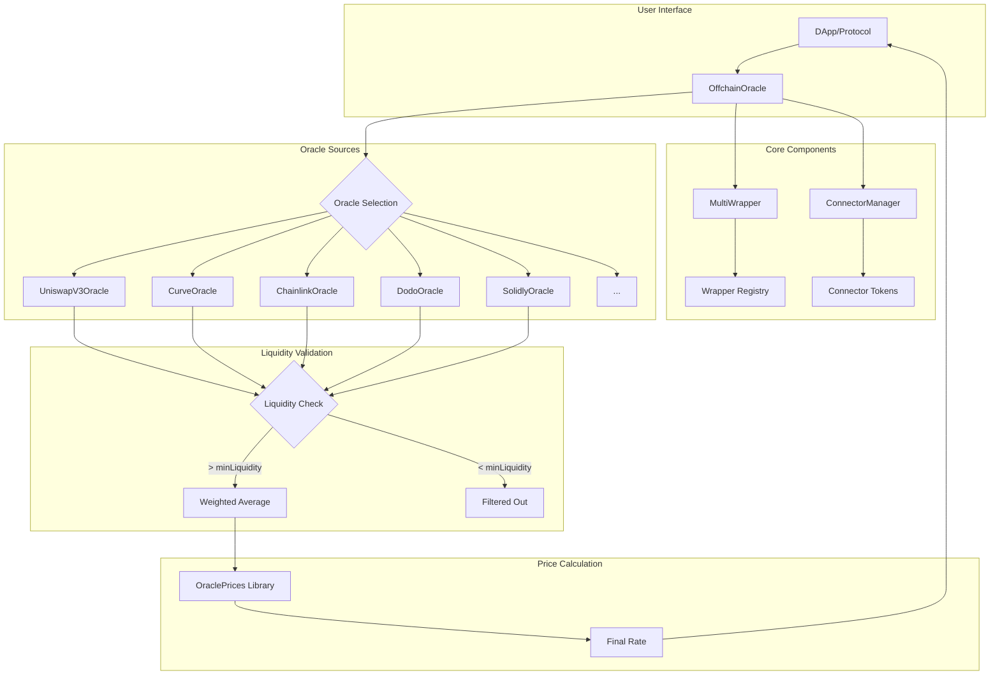
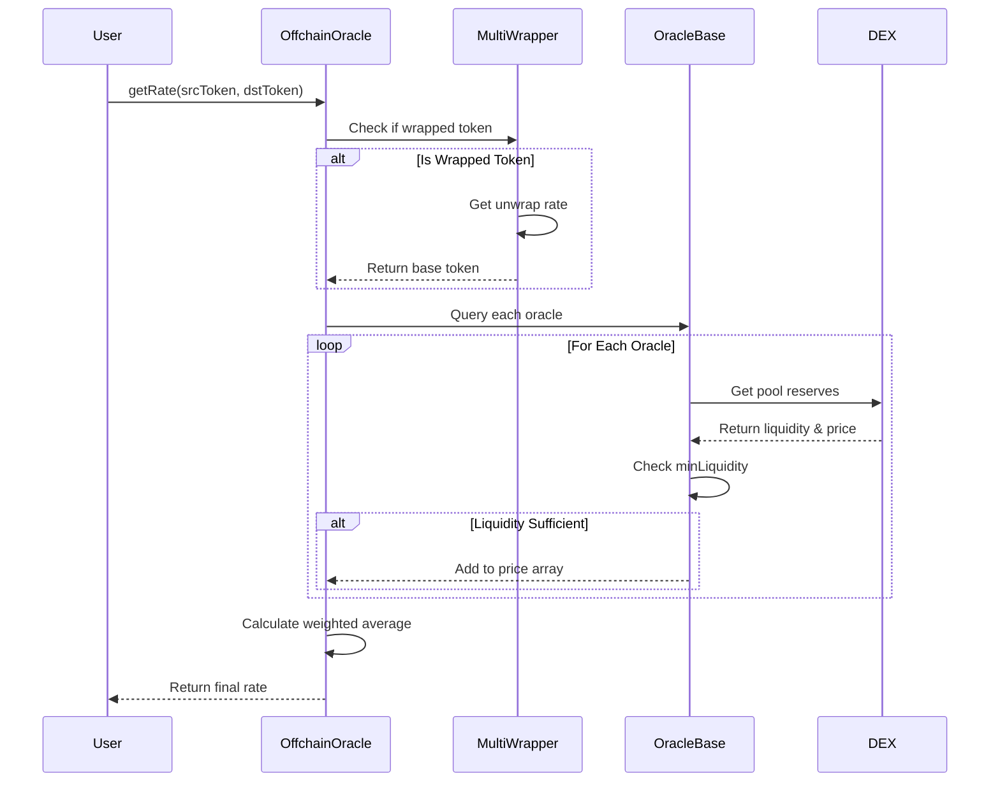

# 1inch Offchain Oracle Protocol

## Short Description

The 1inch Offchain Oracle is a decentralized price aggregation protocol that provides on-chain spot prices by combining liquidity data from multiple DEXes across EVM-compatible chains. It automatically handles wrapped tokens, uses connector tokens for indirect price discovery, and implements liquidity-weighted averaging to ensure accurate pricing while preventing manipulation.

## Potential Benefits

- **Liquidity-Weighted Pricing**: Aggregates prices from 50+ DEX types with configurable liquidity thresholds
- **Cross-DEX Coverage**: Supports Uniswap V2/V3, Curve, Balancer, and protocol-specific AMMs
- **Real-Time Accuracy**: Direct blockchain queries ensure up-to-date pricing without external dependencies
- **Gas Efficiency**: Optimized calculations using the OraclePrices library
- **Manipulation Resistance**: Liquidity thresholds filter out low-liquidity pools
- **Multi-Path Discovery**: Automatic routing through connector tokens when direct pairs don't exist

## Usage Examples

### Basic Price Query
```javascript
const { ethers } = require('ethers');

// Connect to the oracle
const ORACLE_ADDRESS = '0x00000000000D6FFc74A8feb35aF5827bf57f6786';
const oracle = await ethers.getContractAt('IOffchainOracle', ORACLE_ADDRESS);

// Get WETH price in USDC
const WETH = '0xC02aaA39b223FE8D0A0e5C4F27eAD9083C756Cc2';
const USDC = '0xA0b86991c6218b36c1d19D4a2e9Eb0cE3606eB48';

// Oracle will automatically route through connectors (ETH, USDC, etc.)
const rate = await offchainOracle.getRate(WETH, USDC, false);
const numerator = 1e18; // WETH decimals
const denominator = 1e6; // USDC decimals
const price = parseFloat(rate) * numerator / denominator / 1e18;

console.log(`1 WETH = ${ethers.formatUnits(price, 6)} USDC`);
```

### Using Custom Connector Tokens
```javascript
...
// Get price for tokens without direct liquidity pair with your own connectors
const CUSTOM_CONNECTORS = ['0x...', '0x...'];
const RARE_TOKEN = '0x...';
const USDT = '0xdAC17F958D2ee523a2206206994597C13D831ec7';

// Oracle will automatically route through CUSTOM_CONNECTORS
const rate = await oracle.getRateWithCustomConnectors(RARE_TOKEN, USDT, false, CUSTOM_CONNECTORS, 10);
...
```

### Using liquidity-based price filtering
```javascript
...
const WETH = '0xC02aaA39b223FE8D0A0e5C4F27eAD9083C756Cc2';
const USDC = '0xA0b86991c6218b36c1d19D4a2e9Eb0cE3606eB48';
const FILTER = 20;

// Oracle automatically filters out pools whose liquidity weight is less than `FILTER` % of the largest pool
const rate = await oracle.getRateWithThreshold(WETH, USDC, false, FILTER);
...
```

### Wrapped Token Handling
```javascript
...
// Get stETH price in DAI
const stETH = '0xae7ab96520DE3A18E5e111B5EaAb095312D7fE84';
const DAI = '0x6B175474E89094C44Da98b954EedeAC495271d0F';

// Oracle automatically unwraps stETH to ETH for pricing
const rate = await oracle.getRate(stETH, DAI, true);
...
```

### Full examples
* [Single token-to-ETH price usage](https://github.com/1inch-exchange/offchain-oracle/blob/master/examples/single-price.js)

* [Multiple token-to-ETH prices usage](https://github.com/1inch-exchange/offchain-oracle/blob/master/examples/multiple-prices.js)

## Architecture Diagram

### Component Flow


### Data Flow Process


## Deployed Addresses

### Primary Networks

| Network | Oracle Address | Explorer |
|---------|---------------|----------|
| Ethereum | [`0x00000000000D6FFc74A8feb35aF5827bf57f6786`](https://etherscan.io/address/0x00000000000D6FFc74A8feb35aF5827bf57f6786) | Etherscan |
| BSC | [`0x00000000000D6FFc74A8feb35aF5827bf57f6786`](https://bscscan.com/address/0x00000000000D6FFc74A8feb35aF5827bf57f6786) | BscScan |
| Polygon | [`0x00000000000D6FFc74A8feb35aF5827bf57f6786`](https://polygonscan.com/address/0x00000000000D6FFc74A8feb35aF5827bf57f6786) | PolygonScan |
| Arbitrum | [`0x00000000000D6FFc74A8feb35aF5827bf57f6786`](https://arbiscan.io/address/0x00000000000D6FFc74A8feb35aF5827bf57f6786) | Arbiscan |
| Optimism | [`0x00000000000D6FFc74A8feb35aF5827bf57f6786`](https://optimistic.etherscan.io/address/0x00000000000D6FFc74A8feb35aF5827bf57f6786) | Optimistic Etherscan |
| Avalanche | [`0x00000000000D6FFc74A8feb35aF5827bf57f6786`](https://snowtrace.io/address/0x00000000000D6FFc74A8feb35aF5827bf57f6786) | Snowtrace |

### Additional Networks

| Network | Oracle Address | Explorer |
|---------|---------------|----------|
| Gnosis | [`0x00000000000D6FFc74A8feb35aF5827bf57f6786`](https://gnosisscan.io/address/0x00000000000D6FFc74A8feb35aF5827bf57f6786) | GnosisScan |
| Fantom | [`0x00000000000D6FFc74A8feb35aF5827bf57f6786`](https://ftmscan.com/address/0x00000000000D6FFc74A8feb35aF5827bf57f6786) | FTMScan |
| Base | [`0x00000000000D6FFc74A8feb35aF5827bf57f6786`](https://basescan.org/address/0x00000000000D6FFc74A8feb35aF5827bf57f6786) | BaseScan |
| Aurora | [`0x00000000000D6FFc74A8feb35aF5827bf57f6786`](https://aurorascan.dev/address/0x00000000000D6FFc74A8feb35aF5827bf57f6786) | AuroraScan |
| Klaytn | [`0x00000000000D6FFc74A8feb35aF5827bf57f6786`](https://scope.klaytn.com/account/0x00000000000D6FFc74A8feb35aF5827bf57f6786) | KlaytnScope |
| zkSync Era | [`0x739B4e7a3ad8210B6315F75b24cfe0D3226f6945`](https://explorer.zksync.io/address/0x739B4e7a3ad8210B6315F75b24cfe0D3226f6945) | zkSync Explorer |

### Deployment Details

All deployments (except zkSync) use the same address through CREATE3, ensuring consistent integration across chains. Each deployment includes:

- **OffchainOracle**: Main price aggregation contract
- **MultiWrapper**: Handles wrapped token conversions
- **Oracle Implementations**: Chain-specific DEX oracles
- **Wrapper Contracts**: Protocol-specific wrappers (Aave, Compound, etc.)

For detailed deployment information including wrapper and oracle addresses, see the [deployments directory](./deployments/).

### Version History

- **v1.0** (May 2021): Initial release with basic DEX support
- **v2.0** (Apr 2023): Added liquidity-based price filtering
- **v2.1** (Jul 2023): Fixed overflow issues, introduced CREATE3 deployment
- **v3.0** (Sep 2023): Optimized calculations with OraclePrices library
- **v3.1** (Jul 2024): Fixed wrapped token pricing edge cases
- **v3.2** (Aug 2024): Added simultaneous price and liquidity queries

## Additional Resources

- [GitHub Repository](https://github.com/1inch/spot-price-aggregator)
- [Technical Documentation](./docs/)
- [Integration Examples](./examples/)
- [Deployment Guide](./deploy/README.md)
